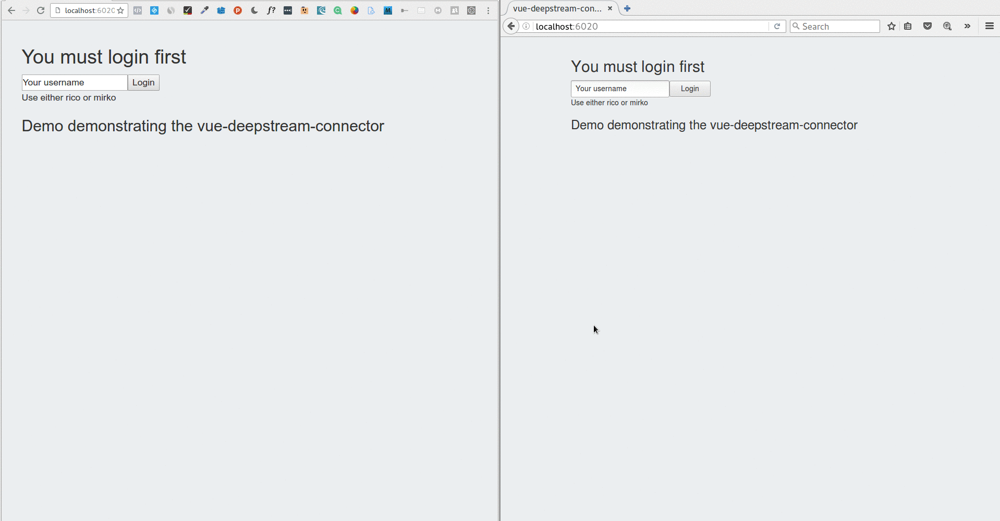

# vue-deepstream-connector

A bridge connector between [Vue](http://vuejs.org) and [Deepstream](http://deepstream.io).

## Get Started
The __vue-deepstream-connector__ allows to intercepts vue's array change detection methods to trigger deepstream's API. It combines them to offer a ___bidirectional data-sync___ option.

## Demo

## Usage

Load the library (either for browser and Node):

    Vue.use(VueDeepStreamConnector)

Sync usage:

    sync: {
      'some-key': function(){
        // It returns a deepstream source
          }
        }

### Browser

    
    

Connect to the deepstream server. Use a custom option named 'ds' always in the root component

    var demo = new Vue({
            ds: {connectionUrl: 'localhost:6020',
                options: {
                    //deepstream client connection options
                    //find them here: https://deepstream.io/docs/client-js/options/
                    }
                }, // You may omit the option object completely
            el: '#demo',
            data: {
                // Your data here
            }
       })

Login to the deepstream server

    this.$dsLogin({username: 'uid', password: 'pwd'}, function(logged, data){
            // logged is either false or true
      })
    }

Sync a single deepstream record:

    sync: {
      object: function(){ // params: recordName
         return this.$dsRecordFetch('welcome')
      }

Sync a whole array/list:

    sync: {
      conversations: function(){ // params: listName
         return this.$dsListFetch('chats')
      } // to insert items in the list use this.conversations.push(object)
        // to remove items from the list use this.conversations.$remove(object)
        // for read only lists use: return this.$dsListFetchReadOnly(listName)

Sync v-model:
Use the ds-sync filter

    <textarea rows="4" cols="50" v-model="editable | ds-sync 'editable'"></textarea>

Retrieve the exact field:

    sync: {
          editable: function(){ // params: recordName, fieldName
             return this.$dsRecordFieldFetch('myRecord', 'myField')
          }
          // using the ds-sync filter will update real-time all the connected clients

### Node

    npm install deepstream.io // install the server
    npm install vue-deepstream-connector // install both client@1.x.x and the connector

### Example (Browser)

Same as the animated gif example

    git clone https://github.com/ecerroni/vue-deepstream-connector.git
    cd vue-deepstream-connector
    cd example
    npm install
    node server
    
Open the browser at http://localhost:6020

## All Methods

- __this.$dsLogin__ // return a callback with the login result status
- __this.$dsLogout__ // logouts the user closing the connection. You may now login with another user
- __this.$dsRecordFieldFetch__ // reactive deepstream source: a specific record's field
- __this.$dsListFetch__ // reactive deepstream source: a list that can be populate with Vue's array mutation functions
- __this.$dsRecordCreate__ // create a record with or without a unique id
- __this.$dsConnect__ //use the 'ds' customOption instead, see above
- __this.$dsListFetchReadOnly__ // reactive deepstream source: a list that can be only read but not mutated (mutation stays only locally until next browser refresh)

## Caveats

So far the vue-deepstream-connector works with:
- Deepstream server 1.0.x
- Deepstream client 1.0.x
- Vue 1.0.x

__Compatibility with vue 2.0 is in the works__

In order to make everything sync seamlessly a "_uid" property is added to every object inserted into the array
This allows an optimistic UI where the new item triggers a View update on the client without waiting the response of the server

### Dynamic components
The connector works well with dynamic components as long as you're working with props.

__If a child component use a method to fetch anything from deepstream you must use the keep-alive param (either in vue-router or is:currentView) to preserve its state and avoid re-rendering__

-----

## VUE-DEEPSTREAM INTEGRATION STATUS

### DONE: [VUE]
- push() // adds "_uid" for you
- splice()
- $set 
- $remove
- v-model ds-sync for text
- v-model ds-sync for textarea

### TO DO: [VUE]
- pop()
- shift()
- unshift()

### NOT PLANNED: [VUE]
- sort()
- reverse()
- v-model ds-sync for number, select, checkbox and radio

### TO DO: [DS]
- Create ds record (sugar syntax and auto "_uid")
- Records
    -	All Events
    -	unsubscribe
    -	discard
    -	delete
- Lists
    -  	All Events
    -	unsubscribe
    -  	discard
    -	delete

### PLANNED: [DS]
-	~~ServerOptions~~ DONE
- 	Connection States
-	~~Login~~ DONE
-	~~Auth & Permissions~~ DONE
-	Anonymous Record
-	RPC
-	ERRORS

### PLANNED: [OTHER]
- free underscore dependency
- ~~avoid the need to pass sync.key to the function call~~ DONE
- ~~repo files with no console logs~~ DONE

## Thanks To
- [Zhou's meteor-vue](https://github.com/zhouzhuojie/meteor-vue)
- [PeakTai's vue-verify](https://github.com/PeakTai/vue-verify)

## LICENSE
---

MIT